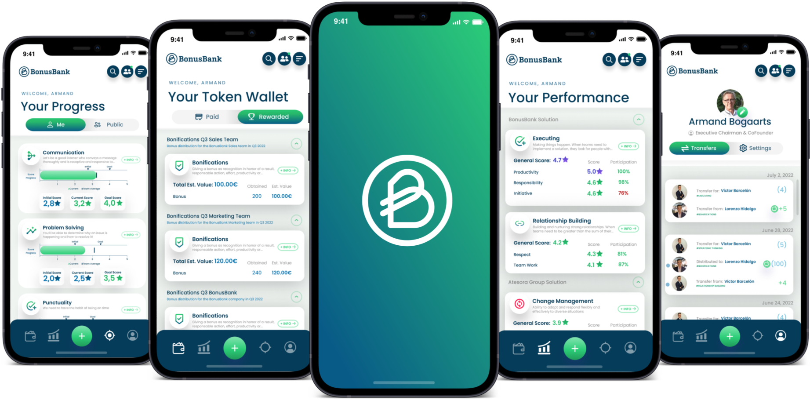

# Introduction to the BonusBank App

Hello! We welcome you to this info series where you will discover everything about BonusBank: from downloading the App, to all functionalities and how to become an authentic expert in Tokenization. Shall we begin?

### What is BonusBank?

Our first question of this discovery journey; and here is the answer: **BonusBank** helps organizations give **feedback**, **recognition**, **incentives** and **rewards on a continuous basis**. It is an important tool for organizations to **improve** the **employee experience and performance management**, thanks to the use of Tokenization (we'll talk about **Tokenization** later).

We know you may have a lot of questions, and we're going to answer them little by little.

Let's first talk about what the **BonusBank** Software consists of:

1. An **APP** (Android and iOS, and the web version) to send and receive feedback, recognition, rewards, incentives and evaluations in a business environment. This application enables **instant**, **flexible** and **transparent** transfers of Tokens between and within the different teams in an organization

2. A **dashboard** that analyzes transaction data for the purpose of creating profiles of employees based on their capabilities and to understand the relationships within the organization

### What can we do?

Within BonusBank you can carry out **5 actions**:

1. **Recognition**. Send Tokens to recognize the skills and abilities of your colleagues or employees or simply to thank or congratulate them

2. **Reward**. Incentivize your employees by sending Tokens associated with monetary rewards, such as: prizes, money, company shares...

3. **Goal**. Define a collective mission and get your Team or Teams to reach it within the defined time limit.

If you want to know more about the 2 types of feedback (Recognition and Reward), we recommend to read this information item. As for defining Goals, you have all the information in [this info item.](http://localhost:3000/docs/general-info/general-intro).

Now that you know what BonusBank is for, we will explain what you need to do to access the App and the Dashboard.

### The App

<table class="invisibleTable">
  <tr>
    <td>
      As you have read before, the <strong>BonusBank App</strong> will be <strong>available</strong> for Android, <strong>iOS</strong> and as a <strong>web version</strong> (to also enjoy the application on PC).
      Below you will find the <strong>links</strong> to go directly to the <strong>Play Store</strong> (for Android) or to the <strong>App Store</strong> (for Apple iOS) and get the App on your phone or tablet in a matter of seconds!    
      <a href="https://play.google.com/store/apps/details?id=com.bonusbank.bonusbank_app"><h3> Access the Play Store (Android)</h3></a>  
      <a href="https://apps.apple.com/us/app/bonusbank/id1578469644"><h3>Access the App Store (iOS)</h3></a>
    </td>
    <td>
      
    </td>

  </tr>
</table>

### Dashboard

<table class="invisibleTable">
  <tr>
    <td>
    
    </td>
    <td>

To access the **dashboard** of BonusBank, you must meet two conditions:

1. Your organization has an agreement with BonusBank
2. You are a manager or have a managerial position within the company

If so, you are almost able to enjoy the full experience. Unfortunately, the dashboard is **not available to everyone** as it reflects user stats (unique to each organization) that not everyone will access to. **Discover your role** and we'll let you know if you can enjoy the management panel!

<a href="https://dash.bonusbank.eu"><h3>Access the Dashboard</h3></a>

</td>

  </tr>
</table>
