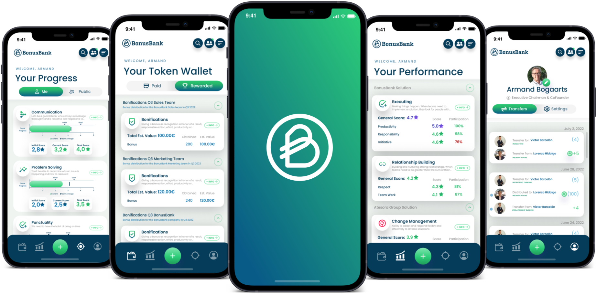
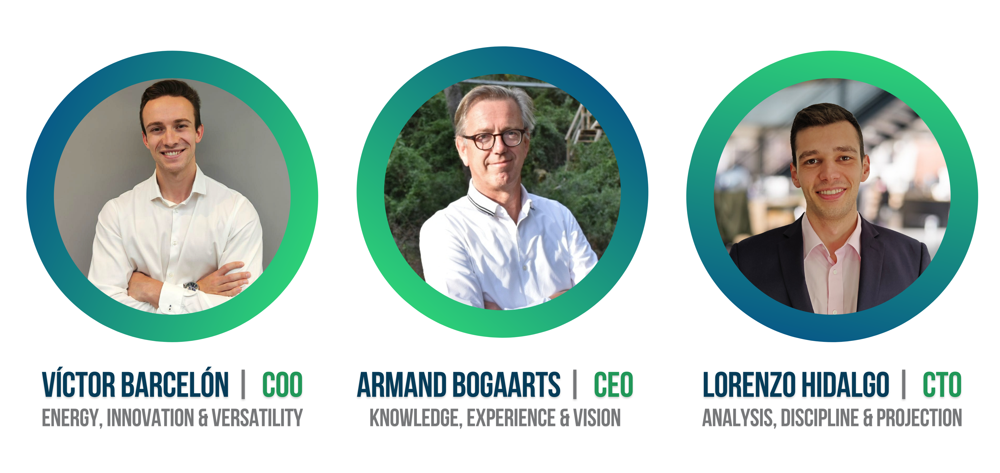

# Introducing BonusBank

<h3> What is BonusBank? </h3>

**BonusBank** is the solution for companies to **speed up feedback, recognition, incentives** and **rewards**. It is an important tool in **improving** the **employee experience**. It also **facilitates performance and talent management** thanks to the use of **Tokenization**.

With **Tokenization**, we ensure that **feedback** and the associated recognition, incentives or rewards is:

- **Continuous**. That is, it can be given continuously **throughout the year**. This provides a picture of the evolution of the performance, socialization and skills of the teams
- **Personalized**. We make sure that every member of the company fully identifies with the feedback and evaluations received
- **Immediately**. In our daily lives we are used to directness so why shouldn't this be possible in the professional environment? If an action deserves recognition, let's not wait 3 months to give it

BonusBank is based on the above principles and is a solution consisting of two important components:

1. A **multi-platform APP** (accessible with Android and iOS, as well as in the web version) to **send** and **receive** recognitions, incentives, evaluations and awards in the business environment. It enables **instant**, **flexible** and **transparent** feedback transactions between and within the different teams in a company
2. An **analytical dashboard** that allows analysis of all transaction data. The data is generated by the main application with the aim to create profiles of the employees based on their abilities and evaluations, and to study the relationships within the organization

## Who is BonusBank?

A question that is often forgotten... But one of great importance.

**BonusBank** was founded by **two young Catalan engineers** with a clear vision about companies of the 21st century, together an experienced **successful entrepreneur** from the Netherlands.

We are a complementary and cohesive team with an eye for human values ​​and a work capacity that guarantees the personal and professional growth of all our teams and of the company in general.

**BonusBank was born as a result of a common problem** experienced by all three founders, but seen from two very different points of view: in **Armand's case**, the **frustration** of a **CEO** who wanted to be able to instantly **recognize**, **encourage** or **reward** effort and results, and wanted to carry out immediate and regular evaluations based on objective and continuous data; on the other hand, **Lorenzo and Víctor**, from the employee´s point of view, the **lack of motivation**, **recognition** and **insight** into their personal functioning provided by their superiors with regard to their achievements and their daily tasks.

Thanks to these **two visions**: that of the **manager** and that of the **employee**, a solution to a shared problem called **BONUSBANK** was found.

## Where to find BonusBank?

We always try to be as close to you as possible so you can enjoy the content we generate every day to **answer** your **questions**, **inquire** about **current issues** or to just **get your feedback** and use it to improve our services.

You can currently find us both individually and as a company on the following platforms:

- LinkedIn. This is our **most active network**, where you can enjoy articles, ideas, humor, current news ... All related to 21st century companies, organizational change, agile methodologies and other very interesting topics.
  - Don't hesitate to contact any of us to ask questions, discuss a topic or just chat with us: Armand, Lorenzo and Víctor.
- Twitter. Our second most favorite social network, where we always try to keep you up to date with our publications on LinkedIn and everything that's happening in the world of **BonusBank**. You know, if you're not that active on LinkedIn, there are no excuses!
- YouTube. We have a **channel** with quality content; currently a series of **interviews** with great professionals called "**Sapere Aude**". In this series of conversations, we have had the opportunity to share opinions and ideas with leaders in their sector and with a common denominator: PEOPLE. Do not hesitate to participate and enjoy some of the lectures, and also watch BonusBank's promotional video!
- Internet. You can go to our website and discover in detail what **BonusBank** is, who we are and much more. In addition, we have a blog where you find **articles** related to **BonusBank interviews** and short summaries of the "Sapere Aude"; all this in case you want to get an idea of ​​what to expect!

Of course you can also get in touch with us in more "traditional" ways. On the web, but also on other platforms, you can find our **emails** and **telephone number** and we will be happy to help you.

Now the time has come... **It's time to discover the power of Tokenization!**
